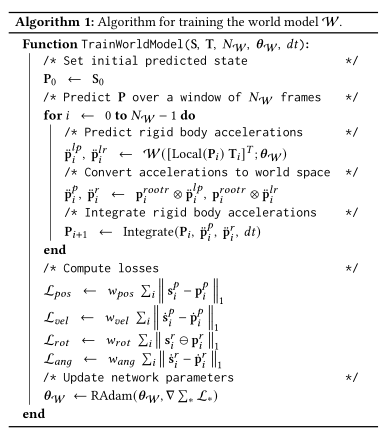
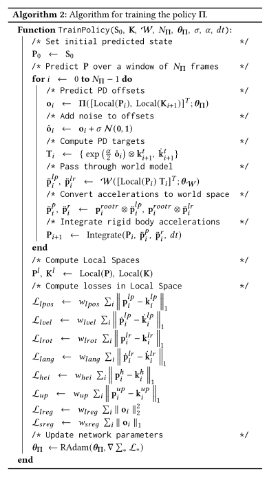

## Refs

- [OpenReview](https://montreal.ubisoft.com/en/supertrack-motion-tracking-for-physically-simulated-characters-using-supervised-learning/)
- [Download PDF](https://static-wordpress.akamaized.net/montreal.ubisoft.com/wp-content/uploads/2021/11/24183638/SuperTrack.pdf)
- [Implementation (not found)]()

### Bibtex

```text
@article{fussell2021supertrack,
  title={SuperTrack: motion tracking for physically simulated characters using supervised learning},
  author={Fussell, Levi and Bergamin, Kevin and Holden, Daniel},
  journal={ACM Transactions on Graphics (TOG)},
  volume={40},
  number={6},
  pages={1--13},
  year={2021},
  publisher={ACM New York, NY, USA}
}
```

## Overview

- Motion tracking for physically simulated characters
- Solved using supervised learning and optimizing a policy directly via back-propagation
  - PPO is sample inefficient, sensitive to hyper-parameters, gym design
  - motion tracking can be formulated with only supervised learning and back-propagation
    - a form of model-based learning
    - produce the optimal actions which minimize the tracking loss
- direct optimization of the policy achieves higher quality
  - shorter training time
  - reduced sensitivity
- notes
  - loss function: a simple, differentiable function
  - transition function of the two individual character states are separate
  - transition function is entirely the result of a deterministic physics simulation
  - physics simulation with a neural network
- use world models
  - to approximate a specific subset of the environment's transition function
  - act as a differentiable physics simulator
    - the policy can be optimized to minimize the tracking error
  - trained to predict the next simulated character state given the previous states
- use policy net
  - produce the PD offsets given the simulated and kinematic character states
- we setup an interactive training environment
  - resembling an RL gym
  - writes data into a large cyclic buffer
  - train each network in tandem on random samples from this buffer

## Related Works

### Model-based learning

- use underlying model of the physical system
- struggles when the dimension of action space grows

## Learned World Models

- a generic differentiable model
  - a neural network on observation of the system in a supervised way
  - provide a differentiable approximation which is used for gradient based optimization
- trained to approximate the transition function of the environment

## Methodology

### Environment

- RL gym
  - similar to [DeepMimic](https://github.com/xbpeng/DeepMimic)
- Observation represented with
  - position [$\bm{x}^p\in\mathbb{R}^3$]
  - velocity[$\dot{\bm{x}}^p\in\mathbb{R}^3$]
  - rotations[$\bm{x}^r\in\mathbb{R}^4$] (Quaternions)
  - rotational velocity[$\dot{\bm{x}}^r\in\mathbb{R}^3$]
- PD target $T$ represented by
  - target rotation[$\bm{t}\in\mathbb{R}^4$]
  - target rotational velocity[$\dot{\bm{t}}\in\mathbb{R}^3$]
- Network Inputs
  - !: global space coordinates are inappropriate
  - convert the rigid body coordinates into the character space by multiplying by the inverse of the root rigid body transform
  - convert quaternions into the two-axis rotation matrix format
  - append to the representation the heights of all the rigid bodies from the ground as well as the up direction, local to the root rigid body

$$
\begin{aligned}
  \mathrm{Local}(\bm{X})=&\left\{\bm{x}^{lp}, \dot{\bm{x}}^{lp}, \bm{x}^{lr}, \dot{\bm{x}}^{lr}, \bm{x}^{h}, \bm{x}^{up}\right\}\\
  \bm{x}^{lp}\in\mathbb{R}^3=&\mathrm{Inv}(\bm{x}^{r_r})\otimes(\bm{x}^p-\bm{x}^{p_r}) \\
  \dot{\bm{x}}^{lp}\in\mathbb{R}^3=&\mathrm{Inv}(\bm{x}^{r_r})\otimes\dot{\bm{x}}^p \\
  \bm{x}^{lr}\in\mathbb{R}^6=&\mathrm{TwoAxis}(\mathrm{Inv}(\bm{x}^{r_r})\otimes\bm{x}^r) \\
  \dot{\bm{x}}^{lr}\in\mathbb{R}^3=&\mathrm{Inv}(\bm{x}^{r_r})\otimes\dot{\bm{x}}^r \\
  \bm{x}^{h}\in\mathbb{R}^1=&\mathrm{Height}(\bm{x}^p) \\
  \bm{x}^{up}\in\mathbb{R}^3=&\mathrm{Inv}(\bm{x}^{r_r})\otimes(0,0,1)^T \\
\end{aligned}
$$

- $\mathrm{TwoAxis}$ converts from quaternion to rotation matrix and extracts the first two columns
- $\bm{x}^{p_r}, \bm{x}^{r_r}$: denote the world space root position and orientation of the character
- $\otimes$: quaternion - quaternion multiplication or quaternion - vector product
- Normalize them all

### Train the World Model $\mathcal{W}$.

- Sample window of $N_\mathcal{W}=8$ frames from the data buffer
- extract the simulated states $S$, and the PD target $T$
- the first frame $S_0$ and the PD target are input into the network $\mathcal{W}$
- the rigid body positional and rotational accelerations are computed (local to root)
  - output: $\ddot{\bm{x}}^{lp}, \ddot{\bm{x}}^{lr} \in\mathbb{R}^3\rightarrow$ world position
  - this is used to find the next state
- compute states for the whole windows
- ↑ explanation for single sample (actual training done using mini-batches)



- weights of contributions of losses are about equal
- $\ominus$: quaternion difference

### Train the Policy

- sample a window of $N_\Pi=32$ frames from the data buffer
- initial simulated state $S_0$ and target kinematic states $K$
- network predicts the PD offsets $o$ from $S_0$ and $K$
- gaussian noise is added to encourage state and action trajectory exploration
- multiplied by the kinematic character joint rotations $\bm{k}^t$
- paired with the kinematic character joint rotational velocities $\dot{\bm{k}}^t$
- PD target are fed into the world model along with the predicted simulated state
  - produce the next simulated state


